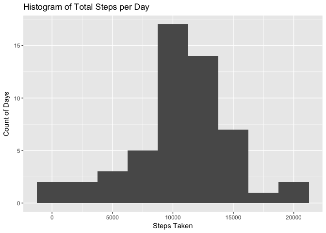

## Loading and preprocessing the data
Prerequisite: first confirm that the working directory is set to the forked and cloned Github repository on your local machine. You will also need the following packages installed: dplyr, tidyverse, ggplot2


```r
zipF <- "./activity.zip"
unzip(zipF)
data <- read.csv("./activity.csv")
```


```r
library(dplyr)
```

```
## 
## Attaching package: 'dplyr'
```

```
## The following objects are masked from 'package:stats':
## 
##     filter, lag
```

```
## The following objects are masked from 'package:base':
## 
##     intersect, setdiff, setequal, union
```

```r
library(tidyverse)
```

```
## ── Attaching packages ──────────────────────────────────────────────────────── tidyverse 1.2.1 ──
```

```
## ✔ ggplot2 2.2.1     ✔ readr   1.1.1
## ✔ tibble  1.4.2     ✔ purrr   0.2.4
## ✔ tidyr   0.7.2     ✔ stringr 1.2.0
## ✔ ggplot2 2.2.1     ✔ forcats 0.3.0
```

```
## ── Conflicts ─────────────────────────────────────────────────────────── tidyverse_conflicts() ──
## ✖ dplyr::filter() masks stats::filter()
## ✖ dplyr::lag()    masks stats::lag()
```

```r
library(ggplot2)
```


## What is mean total number of steps taken per day?


```r
byDate <- data %>% filter(!is.na(data$steps)) %>% group_by(date) %>% summarize(steps = sum(steps))
```


```r
meanSteps <- mean(byDate$steps)
```


```r
medianSteps <- median(byDate$steps)
```

The mean total number of steps taken per day is 1.0766189\times 10^{4}. The median total number of steps taken per day is 10765.

### Make a histogram of the total number of steps taken each day.


```r
g <- ggplot(byDate,aes(steps))
g + geom_histogram(binwidth = 2500) + labs(title = "Histogram of Total Steps per Day", y = "Count of Days", x = "Steps Taken")
```

<!-- -->

## What is the average daily activity pattern?

### Make a time series plot (i.e. 𝚝𝚢𝚙𝚎 = "𝚕") of the 5-minute interval (x-axis) and the average number of steps taken, averaged across all days (y-axis)


```r
byInterval <- data %>% filter(!is.na(data$steps)) %>% group_by(interval) %>% summarize(steps = mean(steps))
```


```r
plot(byInterval$interval, byInterval$steps, type = "l", xlab = "Interval", ylab = "Average Steps Taken", main = "Average Number of Steps Taken per Time Interval - All Days")
```

<!-- -->

### Which 5-minute interval, on average across all the days in the dataset, contains the maximum number of steps?


```r
byInterval %>% slice(steps %>% which.max)
```

```
## # A tibble: 1 x 2
##   interval steps
##      <int> <dbl>
## 1      835   206
```

## Imputing missing values
### Calculate and report the total number of missing values in the dataset (i.e. the total number of rows with 𝙽𝙰s)


```r
NArows <- sum(is.na(data$steps))
```

There are 2304 rows in the data set with NAs. To impute the missing values, we shall use the average across all days for the particular interval for which the value is missing.


```r
impData <- data
impData$steps[is.na(impData$steps)] <- byInterval$steps[match(impData$interval,byInterval$interval)][which(is.na(impData$steps))]
```

### Make a histogram of the total number of steps taken each day and calculate and report the mean and median total number of steps taken per day. Do these values differ from the estimates from the first part of the assignment? What is the impact of imputing missing data on the estimates of the total daily number of steps?


```r
ImpbyDate <- impData %>% group_by(date) %>% summarize(steps = sum(steps))
```


```r
gImp <- ggplot(ImpbyDate,aes(steps))
gImp + geom_histogram(binwidth = 2500) + labs(title = "Histogram of Total Steps per Day with Imputed Data", y = "Count of Days", x = "Steps Taken")
```

<!-- -->


```r
ImpmeanSteps <- mean(ImpbyDate$steps)
```


```r
ImpmedianSteps <- median(ImpbyDate$steps)
```

Once the NA values in the original data set are replaced using the imputation method described above, the mean total number of steps taken per day is 1.0766189\times 10^{4}. The median total number of steps taken per day is 1.0766189\times 10^{4}.

Due to the imputation methodology chosen, the mean of the new data set is the same as the original and the median is very close to the original. The distribution shown in the histogram containing the imputed values is also very close to the original version. The main difference we observe is the increased y-limit of the overall historgram to correspond with the higher frequency counts of each bin representing a particular range of step counts. This is logical given the new data set contains more values of the steps variable than the original.

## Are there differences in activity patterns between weekdays and weekends?

### Create a new factor variable in the dataset with two levels – “weekday” and “weekend” indicating whether a given date is a weekday or weekend day.


```r
impData$daytype <- ifelse(weekdays(as.Date(impData$date)) %in% c("Saturday","Sunday"), "weekend", "weekday")
```

### Make a panel plot containing a time series plot (i.e. 𝚝𝚢𝚙𝚎 = "𝚕") of the 5-minute interval (x-axis) and the average number of steps taken, averaged across all weekday days or weekend days (y-axis).


```r
byIntervalDayType <- impData %>% group_by(daytype, interval) %>% summarize(steps = mean(steps))
```


```r
gpanel <- ggplot(byIntervalDayType, aes(interval,steps))
gpanel <- gpanel + facet_grid(daytype~.) + geom_line()
gpanel <- gpanel + labs(title="Average Number of Steps Taken per Time Interval By Day Type", x="Interval", y="Steps")
gpanel
```

<!-- -->

The panel plot shows that the highest peak of steps for a 5-minute interval occurs during the weekdays.


```r
byIntervalDayType %>% slice(steps %>% which.max)
```

```
## # A tibble: 2 x 3
## # Groups:   daytype [2]
##   daytype interval steps
##   <chr>      <int> <dbl>
## 1 weekday      835   230
## 2 weekend      915   167
```

However, overall the most active day type is the weekend day with more total average steps than a weekday.


```r
byIntervalDayType %>% group_by(daytype) %>% summarize(steps = sum(steps))
```

```
## # A tibble: 2 x 2
##   daytype steps
##   <chr>   <dbl>
## 1 weekday 10256
## 2 weekend 12202
```
